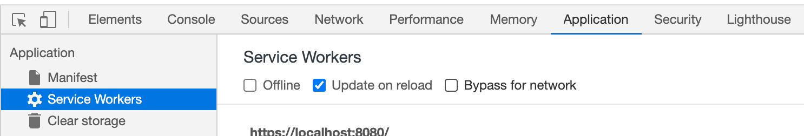

# Camic - Test your camera and microphone online

## Clone the application

Clone the comic repository

```bash
git clone https://github.com/gangadharjannu/camic.git
```

## Development

Since this application has service worker, you will need https to test the functionality properly in local.

So you can use http-server with user generated certificates like below

```
http-server -S -C ./localhost.pem -K ./localhost-key.pem
```

or you can use the webpack which is already configured in package.json

You also need to enable update-on-reload in chrome devtools to get the updated source files from network rather than cache.


## Source code

https://github.com/gangadharjannu/camic.git

## Update npm packages

I use combination of `npm update` and `npm-check-updates` package to regularly update my npm packages.

## See the demo

[github pages](https://gangadharjannu.github.io/camic)

[netlify](https://camic.netlify.app)
